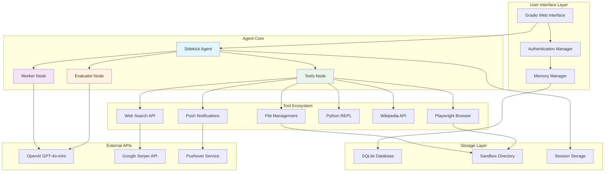

# Sidekick LangGraph Agent

[](https://www.python.org/downloads/)
[](https://github.com/langchain-ai/langgraph)
[](https://openai.com/)
[](https://gradio.app/)
[](https://www.docker.com/)
[](https://astral.sh/uv)
[](https://github.com/psf/black)
[](https://github.com/astral-sh/ruff)
[](https://mypy.readthedocs.io/)
[](https://opensource.org/licenses/MIT)

A sophisticated AI agent built with LangGraph that autonomously completes complex tasks using web browsing, file management, Python execution, and web search tools. Features self-evaluation against user-defined success criteria for reliable task completion.

## 🏗️ System Architecture



## ✨ Features

- **Autonomous Task Execution**: Completes complex multi-step tasks independently
- **Self-Evaluation**: Assesses task completion against user-defined success criteria
- **Web Automation**: Browser automation using Playwright with automatic headless/headed mode detection
- **File Management**: Secure file operations within a sandboxed environment
- **Web Search**: Real-time web search capabilities via Google Serper API
- **Python Execution**: Safe Python code execution environment
- **Knowledge Access**: Wikipedia integration for research tasks
- **Push Notifications**: Task completion alerts via Pushover
- **Memory Persistence**: Conversation and task history storage
- **User Authentication**: Secure user session management

## 🚀 Quick Start

### Prerequisites

- Python 3.11 or higher
- OpenAI API key
- Google Serper API key (for web search)
- Pushover credentials (optional, for notifications)

### Installation Options

#### Option 1: Using UV (Recommended)

UV is a fast Python package manager that provides better dependency resolution and faster installs.

```bash
# Install UV if you haven't already
curl -LsSf https://astral.sh/uv/install.sh | sh

# Clone the repository
git clone https://github.com/yourusername/Sidekick-Langraph-Agent.git
cd Sidekick-Langraph-Agent

# Install dependencies
uv sync

# Run the application
uv run python app.py
```

#### Option 2: Using Docker

```bash
# Clone the repository
git clone https://github.com/yourusername/Sidekick-Langraph-Agent.git
cd Sidekick-Langraph-Agent

# Create environment file
cp .env.example .env
# Edit .env with your API keys

# Build and run with Docker Compose
docker-compose up --build

# Or run in development mode with live reload
docker-compose --profile dev up --build
```

**Note**: The application automatically detects Docker environments and runs the browser in headless mode. No additional configuration is needed for containerized deployment.

#### Option 3: Traditional Python Installation

```bash
# Clone the repository
git clone https://github.com/yourusername/Sidekick-Langraph-Agent.git
cd Sidekick-Langraph-Agent

# Create virtual environment
python -m venv venv
source venv/bin/activate  # On Windows: venv\Scripts\activate

# Install dependencies
pip install -e .

# Run the application
python app.py
```

### Environment Configuration

Create a `.env` file in the project root:

```env
# Required
OPENAI_API_KEY=your_openai_api_key_here
SERPER_API_KEY=your_serper_api_key_here

# Optional (for push notifications)
PUSHOVER_TOKEN=your_pushover_token
PUSHOVER_USER=your_pushover_user_key

# Optional (customize Gradio server)
GRADIO_SERVER_NAME=127.0.0.1
GRADIO_SERVER_PORT=7860
```

## 📋 Usage

1. **Start the Application**: Use one of the installation methods above
2. **Access the Web Interface**: Open http://localhost:7860 in your browser
3. **Authenticate**: Create an account or log in
4. **Define Your Task**: Enter your task description and success criteria
5. **Monitor Progress**: Watch as the agent autonomously works on your task
6. **Review Results**: Evaluate the completed work and provide feedback

### Example Tasks

- "Research the latest AI developments and create a summary report"
- "Find and download a dataset about climate change, then analyze it"
- "Create a web scraper for product prices and save the data to CSV"
- "Write and test a Python script that processes image files"

## 🛠️ Development

### Development Setup

```bash
# Install with development dependencies
uv sync --group dev

# Install pre-commit hooks
uv run pre-commit install

# Run code formatting
uv run black .

# Run linting
uv run ruff check .

# Run type checking
uv run mypy .
```

### Code Quality Standards

- **Formatting**: Black (88 character line length)
- **Linting**: Ruff with comprehensive rule set
- **Type Checking**: MyPy with strict settings
- **Commit Hooks**: Pre-commit for automated quality checks

### Project Structure

```
├── app.py                 # Main Gradio application
├── sidekick.py           # Core LangGraph agent
├── sidekick_tools.py     # Tool implementations
├── auth_manager.py       # User authentication
├── memory_manager.py     # Memory and session management
├── ui_components.py      # Gradio UI components
├── config.py            # Configuration management
├── memory/              # SQLite databases
├── sandbox/             # Sandboxed file operations
├── Dockerfile           # Container configuration
├── docker-compose.yml   # Multi-container setup
└── pyproject.toml       # Project dependencies
```

## 🔧 Configuration

### Agent Configuration

The agent behavior can be customized through `config.py`:

- **Recursion Limit**: Maximum iterations for task execution
- **Tool Timeouts**: Individual tool execution timeouts
- **Memory Settings**: Conversation history retention
- **Browser Settings**: Playwright configuration options

### Browser Configuration

The application automatically configures the browser based on the environment:

- **Local Development**: Browser runs in headed mode (visible) by default
- **Docker/Containerized**: Browser automatically switches to headless mode
- **No Display Environment**: Automatically detects and uses headless mode

**Manual Override**: Set the `DISPLAY` environment variable to force headless mode:
```bash
export DISPLAY=  # Forces headless mode
```

### Security Features

- **Sandboxed Execution**: All file operations occur in `sandbox/` directory
- **Memory Isolation**: User sessions are isolated
- **API Key Protection**: Environment-based credential management
- **Input Validation**: Comprehensive input sanitization

## 📚 API Documentation

### Tools Available to the Agent

| Tool | Description | Use Cases |
|------|-------------|-----------|
| Browser | Playwright web automation | Web scraping, form filling, navigation |
| File Manager | Sandboxed file operations | Reading, writing, organizing files |
| Web Search | Google Serper integration | Research, fact-checking, discovery |
| Python REPL | Code execution environment | Data analysis, automation scripts |
| Wikipedia | Knowledge base access | Research, fact verification |
| Notifications | Pushover integration | Task completion alerts |

### Agent Workflow

1. **Task Initialization**: Parse user input and success criteria
2. **Planning Phase**: Analyze task requirements and available tools
3. **Execution Loop**: 
   - Select appropriate tools
   - Execute actions
   - Evaluate progress
   - Continue or iterate
4. **Completion Assessment**: Verify success criteria are met
5. **Result Reporting**: Provide detailed task completion summary

## 🐛 Troubleshooting

### Common Issues

#### Browser Configuration Issues

**"Agent not initialized" Error**: Usually indicates browser startup failure.
```bash
# Check if the browser is properly configured
docker logs sidekick-langraph-agent-sidekick-agent-1 | grep "Creating shared browser instance"
# Should show: "🌐 Creating shared browser instance (headless=True)..." for Docker
```

**X Server Errors in Docker**: Indicates headless mode is not being used properly.
```bash
# Force headless mode if detection fails
export DOCKER_ENV=true
```

#### Playwright Browser Issues
```bash
# Reinstall Playwright browsers
uv run playwright install chromium
```

#### Memory Database Errors
```bash
# Reset the memory database
rm -rf memory/
mkdir memory
```

#### UV Installation Issues
```bash
# Verify UV installation
uv --version

# Reinstall dependencies
uv sync --reinstall
```

#### Docker Issues
```bash
# Rebuild without cache
docker-compose build --no-cache

# Check logs for browser initialization
docker-compose logs sidekick-agent | grep -E "(browser|headless|DISPLAY)"

# Restart container
docker-compose restart sidekick-agent
```

### Performance Optimization

- **Memory Usage**: Regularly clear conversation history for long-running sessions
- **Browser Resources**: The agent automatically manages browser cleanup
- **Database Maintenance**: SQLite databases are automatically maintained
- **Container Resources**: Adjust Docker memory limits for large tasks

## 🤝 Contributing

1. Fork the repository
2. Create a feature branch: `git checkout -b feature-name`
3. Make your changes with proper tests
4. Run quality checks: `uv run black . && uv run ruff check . && uv run mypy .`
5. Commit your changes: `git commit -m "Add feature"`
6. Push to the branch: `git push origin feature-name`
7. Submit a pull request

## 📄 License

This project is licensed under the MIT License - see the [LICENSE](LICENSE) file for details.

## 🙏 Acknowledgments

- **LangGraph**: For the agent framework
- **OpenAI**: For the language model capabilities
- **Gradio**: For the web interface
- **Playwright**: For browser automation
- **UV**: For fast Python package management

---

**Need Help?** Open an issue on GitHub or check the troubleshooting section above.